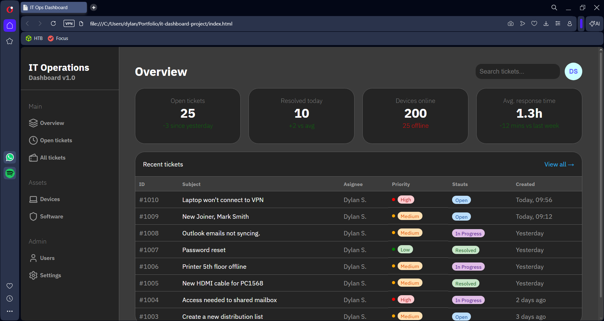

# IT Operations Dashboard

A clean, responsive IT helpdesk dashboard built with HTML and CSS. Designed as a concept UI for internal IT teams to monitor tickets, devices, and response times at a glance.

🔗 [View Live Demo](https://sehdevd.github.io/it-dashboard-project/)



## Built With

- HTML5
- CSS3
- IBM Plex Sans (Google Fonts)
- Lucide Icons

## Features

- Sidebar navigation with grouped sections (Main, Assets, Admin)
- Lucide icons integrated into the sidebar
- Stat cards displaying key metrics (open tickets, resolved today, devices online, avg. response time)
- Recent tickets table with priority and status badges
- Colour-coded priority indicators (High, Medium, Low) with dot indicators
- Dark theme UI

## Planned Features

- JavaScript interactivity (filtering, sorting tickets)
- Additional pages — Devices, Software, Users, Settings
- Ticket creation and management
- Charts and data visualisation for metrics

## Getting Started

No installations or dependencies needed. Simply clone the repo and open `index.html` in your browser.
```bash
git clone https://github.com/sehdevd/it-dashboard-project.git
```

## Deployment

This project is hosted on GitHub Pages and can be viewed live at:
https://sehdevd.github.io/it-dashboard-project/

## Author

Dylan S.

---

Built as part of a personal portfolio to demonstrate front-end development skills.